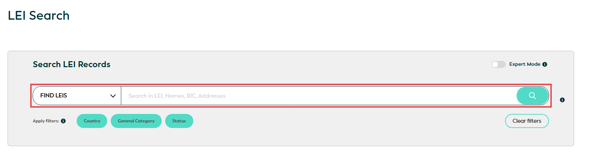
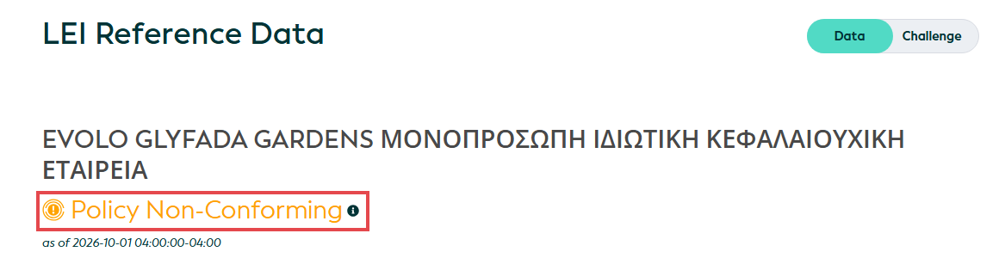
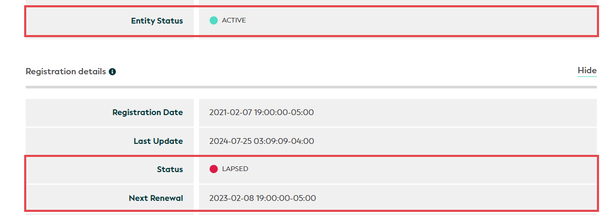

# How to Verify a Business Customer's Legal Entity Identifier (LEI)

> **About this sample:** Brinwell Payments is a fictional company that provides the use case for this guide. The LEI records shown are real public records from the Global LEI Index, captured on 1 and 5 October 2026 and used only as examples. The companies were chosen because their records illustrate situations KYB analysts frequently encounter. The author has no connection to any of them. A lapsed LEI reflects the status of the record, not any judgment about the company.

**Audience:** KYB (Know Your Business) analysts, Brinwell Payments onboarding team

**Last updated:** 6 October 2026

## Purpose

This guide shows how to use the [Global LEI Index](https://search.gleif.org) to look up a business customer's Legal Entity Identifier (LEI), read its record, and spot problems that affect onboarding. An LEI is a 20-character code that identifies a legal entity, such as a company, in financial transactions. It works like a global ID number. Legal entities in any country can obtain an LEI from an accredited LEI issuer.

At Brinwell, the LEI matters most for currency hedging. EU rules on derivatives ([EMIR](https://www.esma.europa.eu/data-reporting/emir-reporting)) require each company in a derivative trade to be identified by its LEI, so a customer must have a valid LEI before they can use hedging products.

## Scope

This guide covers:

- Business customers established in an EU member state
- Looking up an LEI on the Global LEI Index ([search.gleif.org](https://search.gleif.org))
- Checking the LEI's status and the company details linked to it

The LEI system is global, and the search steps work the same way for a company in any country. This guide is limited to EU customers because Brinwell's decision rules are based on EU requirements.

This guide doesn't cover:

- **Funds.** Fund records have additional relationship data and follow a separate process.
- **UK-based customers.** Since Brexit, UK companies fall under separate UK reporting rules.
- **Ownership data.** LEI records have **Parents** and **Children** sections. This guide doesn't use them. The Parents section names the parent companies of the company under review, meaning the businesses that include its results in their group accounts. It never names the people who ultimately own or control the company under review (its beneficial owners). Even when individuals control the company, the record shows only a code such as NATURAL\_PERSONS. This means the LEI record can't be used to identify beneficial owners. Follow Brinwell's beneficial ownership procedure for that check.
- **Full customer due diligence.** This guide covers the LEI check only. Complete the rest of the onboarding checks as usual, following Brinwell's customer due diligence procedure.

## Key terms

| Term | Meaning |
| --- | --- |
| LEI (Legal Entity Identifier) | A 20-character code of letters and numbers that identifies a legal entity, such as a company, in financial transactions. Example: 5299009X5HKSKJEWEV74 |
| GLEIF | The Global Legal Entity Identifier Foundation, which manages the global LEI system, accredits LEI issuers and publishes the Global LEI Index |
| LEI issuer | An organization accredited by GLEIF to issue and renew LEIs, also called a Local Operating Unit (LOU). A company can use any issuer accredited for its country, so the issuer may be based elsewhere. GLEIF lists accredited issuers on its [Get an LEI](https://www.gleif.org/en/organizational-identity/get-an-lei-vlei/get-an-lei-find-lei-issuing-organizations) page. A company's current issuer is shown in the **LEI Issuer** field of its record |
| Entity Status | Whether the **company** is operating, as last reported: ACTIVE or INACTIVE |
| Registration Status (shown as **Status** on the record and **Reg. Status** in search results) | Whether the **LEI** is current: for example, ISSUED or LAPSED |
| Policy Conformity label | A label at the top of each record: Policy Conforming, Policy Non-Conforming, or LEI end state - Policy Not Applicable for LEIs no longer in use. **Policy Conforming** means the LEI was renewed on time and the company has reported its parent companies (or given an accepted reason for not reporting them). See GLEIF's [Policy Conformity Flag](https://www.gleif.org/en/lei-data/access-and-use-lei-data/policy-conformity-flag) page |

> **Important:** Entity Status and Registration Status are separate. Always check both.

## Before you start

You don't need an account: the Global LEI Index ([search.gleif.org](https://search.gleif.org)) is free and open to everyone.

  > **Note:** GLEIF's [How to use LEI Search](https://www.gleif.org/en/lei-data/lei-search/about-lei-search/how-to-use-lei-search) page differs from the live site in three respects: it describes the search field as being at the top right of the screen, omits the FIND LEIS drop-down, and labels the results column Registration Status rather than Reg. Status. The steps in this guide follow the live site as verified on 6 October 2026.

You should have the following details from the customer's onboarding file:

- **The company's full legal name.** If the name is normally written in a non-Latin alphabet, such as Greek, have it in both the original alphabet and Latin letters.
- **The country where the company is registered.**
- **The company's register number,** for every customer. You'll use it to confirm you've found the right company.
- **For German companies only: the register court** (for example, Amtsgericht Oldenburg). In Germany, different courts can use the same register number, so a German register number only identifies one company when it's combined with its court.
- **The company's LEI,** if the customer provided one.

## Steps

### 1. Open the Global LEI Index

Go to [search.gleif.org](https://search.gleif.org).

*Figure 1. The Search LEI Records box. Captured 5 October 2026.*

### 2. Search for the company

In the **Search LEI Records** box, check that the drop-down on the left shows **FIND LEIS**. In the search field, enter the customer's LEI if you have it. If not, enter the company's legal name. Then select the magnifying glass button.

> **Tip:** When searching by name, leave out the legal form. For example, search for "Nordfrost" rather than "Nordfrost GmbH & Co. KG". This finds the record even if the customer wrote the legal form differently. Each result shows the company's country, so you can usually spot the right one in the list. If the list is long, you can narrow it by selecting **Country** under **Apply filters**.

The results appear below the search box, headed **Showing \[number\] results**. They're arranged in five columns: **Country**, **Entity Status**, **Legal name**, **LEI** and **Reg. Status** (Registration Status).

### 3. Find the matching record

In the results, find the row whose legal name and country match the onboarding file.

The search looks at addresses as well as names, so the results can include companies whose names don't contain your search term. For example, a search for "Nordfrost" filtered to Germany returns four companies: Nordfrost GmbH & Co. KG, plus AGRO Handelsgesellschaft mbH, ECT Service GmbH and FRIGOROPA GmbH, which appear because "Nordfrost" is part of their address. Check the legal name carefully. You'll confirm the match in step 5.

*Figure 2. Results for "Nordfrost", filtered to Germany. Captured 5 October 2026.*

> **Tip:** The results already show both statuses, so you may spot a problem before you open the record. For a company whose legal name uses a non-Latin alphabet, the results also show the transliterated name (in Latin letters) below it. Even if the results look fine, complete steps 4 to 7 before you decide.

*Figure 3. A search in Latin letters finds a company whose legal name is partly in Greek. The results show it is ACTIVE with a LAPSED LEI. Captured 5 October 2026.*

### 4. Open the record and check the Policy Conformity label

Select the company's legal name in the results (for example, **Nordfrost GmbH & Co. KG**) to open its record. Below the company name at the top of the record, check the label:

- **Policy Conforming:** the LEI is current and parent information is reported. Continue with step 5.
- **Policy Non-Conforming:** either the LEI hasn't been renewed on time, or parent information is missing. Continue with step 5. To find out which problem it is, check the LEI's **Status** in step 7. If it shows LAPSED, the LEI wasn't renewed. If it shows ISSUED, parent information is missing.
- **LEI end state - Policy Not Applicable:** the LEI is no longer in use, for example because the company has stopped operating. Continue with step 5; the decision table tells you what to do.

*Figure 4. Top of the Evolo Glyfada Gardens record. Captured 1 October 2026.*

### 5. Confirm it's the right company

Compare these fields with the onboarding file:

- **(Primary) Legal Name** and, if shown, **Transliterated Names** (the name in Latin letters)
- **Registered At** (the company register) and **Registered As** (the register number)
- The **Legal** address

Names can differ for harmless reasons. In the Evolo Glyfada Gardens record, the legal name includes the legal form in Greek letters, and the transliterated name leaves the legal form out entirely. A customer might write "Evolo Glyfada Gardens IKE". When names differ only in script or legal form, use the register number to confirm the match.

If the register number doesn't match, don't continue. See **Troubleshooting**.

### 6. Check the Entity Status

Find **Entity Status** in the top section of the record. It shows a colored dot and a word, for example a green dot and ACTIVE. Read the status from the word, not the color of the dot.

### 7. Check the LEI's Status and Next Renewal date

Scroll to **Registration details**. Note the **Status** and the **Next Renewal** date.

> **Important:** An ACTIVE company can still have a LAPSED LEI, so always check both statuses. In the example below, **Entity Status** shows a green dot and ACTIVE, but the LEI's **Status** shows a red dot and LAPSED: the LEI wasn't renewed by February 2023.

*Figure 5. Evolo Glyfada Gardens: the company is ACTIVE, but its LEI is LAPSED. Captured 1 October 2026.*

### 8. Find the required action in the decision table

In the **Decision table** below, find the row that matches the record's Entity Status, Status and Policy Conformity label. Follow the action in that row.

### 9. Tell the customer, if hedging is on hold

If the decision table puts hedging on hold, contact the customer through your usual onboarding channel. Explain that hedging is on hold and what they need to do, for example renew their LEI with their LEI issuer (shown in the record's **LEI Issuer** field).

### 10. Record the result

In the onboarding file, record:

- The LEI
- Entity Status, Registration Status and Policy Conformity label
- The date you checked
- Your decision
- The recheck date, if there is one

## Decision table

| Record shows | Action |
| --- | --- |
| Entity ACTIVE, Status ISSUED, Policy Conforming | Proceed. The customer can use hedging products. |
| Entity ACTIVE, Status ISSUED, Policy Non-Conforming | Escalate to your team lead. Parent information is missing from the record. |
| Entity ACTIVE, Status LAPSED | Onboard the customer but put hedging on hold. Ask the customer to renew their LEI. Recheck when they confirm renewal, or after 10 business days. If it's still lapsed after 30 business days, escalate. |
| No LEI found, and the customer confirms they don't have one | Onboard the customer but put hedging on hold. Ask the customer to obtain an LEI, then repeat the check. They can apply directly to an accredited LEI issuer or through a registration agent (both are listed on GLEIF's [Get an LEI](https://www.gleif.org/en/organizational-identity/get-an-lei-vlei/get-an-lei-find-lei-issuing-organizations) page; see LEI issuer in **Key terms**). Some banks and other financial service providers, known as validation agents, can also obtain an LEI on a client's behalf. |
| Status PENDING\_TRANSFER or PENDING\_ARCHIVAL | The LEI is being transferred to a different LEI issuer. The LEI code itself stays the same. Onboard the customer, hold hedging until the Status is ISSUED, and tell the customer. Recheck after 5 business days. If it's still pending, escalate. |
| Status DUPLICATE | Don't use this LEI. The company has another LEI that replaces it, so search again and repeat the check with the correct one. |
| Status RETIRED, or Entity INACTIVE | Don't proceed. The company has stopped operating. Confirm with the customer that they gave you the right company and LEI. If they did, escalate. |
| Status MERGED | Don't use this LEI. The company has merged into another. If the record names a successor company, check whether your customer is that company, and if so, repeat the check with its LEI. If not, escalate. |
| Status ANNULLED | Escalate. This LEI was found to be invalid after it was issued and can't be used. |
| Statuses that contradict each other (for example, Entity INACTIVE with Status ISSUED) | Escalate. [GLEIF's rules](https://www.gleif.org/lei-data/access-and-use-lei-data/level-1-data-lei-cdf-3-1-format/2025-07-03_state-transition-validation-rules_2.8.5_final.pdf) don't allow this combination, so the record is probably wrong. |

To recheck, repeat steps 2 to 7.

## Troubleshooting

| Problem | What to do |
| --- | --- |
| No result for the LEI | Check that it's exactly 20 characters, with no typos or extra spaces. If you still get no result, search by legal name. |
| No result for the legal name | Search again without the legal form, or with the name in the local language. If there's still no result, ask the customer to confirm they have an LEI. |
| No result for a Greek company's name | Greek names can be written in Latin letters in more than one way, and the search only finds the spelling you type. For example, "Evolo Glyfada" finds Evolo Glyfada Gardens, but "Evolo Glifada" doesn't. Try another spelling, or search in Greek letters. |
| The name in the record doesn't match the onboarding file | If the difference is only the script or the legal form, confirm the match using the register number. |
| Several companies with similar names | Compare the legal form and register number. For German companies, also compare the register court. |
| The register number or court is different | The customer may have given an old name, number or court: German registers can move between courts. Check the company's history in the official register (for German companies, [handelsregister.de](https://www.handelsregister.de)). If it still doesn't match, escalate. |
| A field is missing from the record | Not every record has every field. Rely on the fields this guide uses. |
| The Parents section shows an exception code (for example, NON\_CONSOLIDATING) | Not a problem on its own. It's an accepted reason for not reporting parent companies. |
| Corroboration Level isn't FULLY\_CORROBORATED | Some details weren't checked against an official register. Confirm the company's name, address and register number in the official register before you proceed. |

## Escalation

Escalate to your team lead when:

- The decision table tells you to escalate
- The record raises a question this guide doesn't answer

Your team lead will review the case and, where needed, refer it to the compliance officer.

**If an LEI record appears to be incorrect:** report it to your team lead with your evidence. Your team lead can [submit a challenge](https://www.gleif.org/en/lei-data/gleif-data-quality-management/challenge-lei-and-vlei-data) to GLEIF, which passes it to the LEI issuer; issuers aim to resolve challenges within ten business days. Hold hedging until your team lead confirms how to proceed, and recheck the record once the challenge is resolved.

**If you suspect fraud or money laundering:** report your concern promptly through Brinwell's procedure for reporting suspicious activity, and don't continue onboarding until you're told how to proceed. Discuss your concern only with the individuals authorized under that procedure.

> **Important:** Never tell the customer that you suspect fraud or money laundering, or that a suspicious activity report has been made. Disclosing this is known as tipping off and is prohibited under EU anti-money laundering law.

## Sources

All sources accessed 5 October 2026.

- Common Register Portal of the German Federal States, [Handelsregister](https://www.handelsregister.de) (German company register)
- ESMA, [EMIR Reporting](https://www.esma.europa.eu/data-reporting/emir-reporting) (LEI requirement for counterparties)
- European Parliament and Council, Regulation (EU) No 648/2012 (EMIR), as amended
- GLEIF, [Challenge LEI and vLEI Data](https://www.gleif.org/en/lei-data/gleif-data-quality-management/challenge-lei-and-vlei-data)
- GLEIF, [Get an LEI: Find LEI Issuing Organizations](https://www.gleif.org/en/organizational-identity/get-an-lei-vlei/get-an-lei-find-lei-issuing-organizations)
- GLEIF, [Global LEI Index (LEI Search)](https://search.gleif.org)
- GLEIF, [How to use LEI Search](https://www.gleif.org/en/lei-data/lei-search/about-lei-search/how-to-use-lei-search)
- GLEIF, [Level 1 Data: LEI-CDF Format 3.1](https://www.gleif.org/en/lei-data/access-and-use-lei-data/level-1-data-lei-cdf-3-1-format) (status definitions)
- GLEIF, [Policy Conformity Flag](https://www.gleif.org/en/lei-data/access-and-use-lei-data/policy-conformity-flag)
- GLEIF, [State Transition and Validation Rules v2.8.5](https://www.gleif.org/lei-data/access-and-use-lei-data/level-1-data-lei-cdf-3-1-format/2025-07-03_state-transition-validation-rules_2.8.5_final.pdf) (status combinations)
